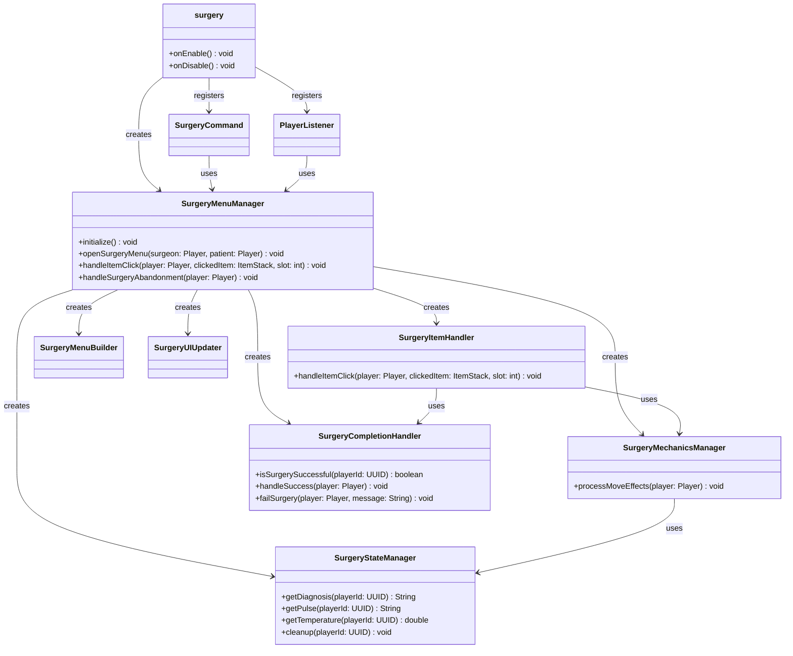

# Surgery

**A Minecraft server plugin that turns healing into a mini-game — open a surgery GUI on another player, diagnose one of 29 ailments, and operate with 14 tools while managing vitals, bleeding, and death timers.**


Built for the [TFMC](https://www.patreon.com/c/TFMCRP) roleplay server, where it runs in production as the medical roleplay system for doctors and field medics.

---

## What It Does

Run `/surgery <player>` next to a patient and a surgery GUI opens: colored status blocks show the patient's consciousness, pulse, temperature, and operation-site cleanliness, while the toolbar holds your surgical instruments. Diagnose with the ultrasound, anesthetize, cut, manage whatever goes wrong, fix the problem, and stitch up — or lose the patient to fever, bleeding, or cardiac arrest.

| | |
|---|---|
| **Interactive surgery GUI** | Inventory-based operating table with live colored status indicators |
| **29 diagnoses** | Injuries, infections, tumors, flu strains, and mysterious ailments — randomly assigned per operation |
| **14 surgical tools** | Scalpel, sponge, stitches, defibrillator, transfusion, and more — each with a specific job |
| **Live patient vitals** | Temperature, pulse, consciousness, and bleeding all shift as the surgery progresses |
| **Skill-fail mechanics** | Every move can fail; bleeding raises the fail chance, sponging lowers it |
| **Bone surgery** | Broken and shattered bones revealed by incisions, repaired with pins and splints |
| **Diagnosis-specific twists** | Flu strains need an exact temperature; Arcane Infection causes random chaos; Lupus patients howl |
| **Time pressure** | Cardiac-arrest countdowns, weak-pulse timers, and hyperthermia death thresholds |
| **Config-driven design** | Diagnoses, incision counts, fail chances, timers, tool items, and all messages live in YAML |

## How It Works

The `/surgery <player>` command validates that the patient is online and within range (5 blocks by default), then opens the surgery menu:

1. `SurgeryMenuBuilder` lays out the GUI and rolls a random diagnosis (hidden until ultrasound) plus the patient's starting vitals and bone state.
2. Every tool click routes through `SurgeryItemHandler`, which resolves the clicked item against the configured TLibs item paths and applies the tool's effect.
3. After each move, `SurgeryMechanicsManager` advances the simulation: temperature rises unless the site is clean, pulse can degrade while bleeding, countdowns tick, and diagnosis-specific mechanics fire.
4. `SurgeryUIUpdater` repaints the status blocks (patient status, pulse, temperature, operation site) with color-coded concrete.
5. `SurgeryCompletionHandler` checks win/lose conditions — a finished surgery runs the configured success console command; a death runs the failure command. Closing the inventory mid-operation abandons (and fails) the surgery.

All per-patient state lives in `SurgeryStateManager` maps keyed by player UUID and is cleaned up when the surgery ends.

## Architecture

One manager per concern, wired together by `SurgeryMenuManager`:

```
src/main/java/tfmc/justin/
├── surgery.java                        # Entry point: wiring, lifecycle
├── commands/
│   └── SurgeryCommand.java             # /surgery <player> validation + menu open
├── listeners/
│   └── PlayerListener.java             # Inventory click/close + join hooks
├── managers/
│   ├── SurgeryMenuManager.java         # Facade: owns and wires all components
│   ├── SurgeryMenuBuilder.java         # GUI layout, diagnosis roll, initial state
│   ├── SurgeryStateManager.java        # Per-patient state maps (UUID-keyed)
│   ├── SurgeryItemHandler.java         # Tool click → effect pipeline
│   ├── SurgeryMechanicsManager.java    # Per-move simulation: temp, pulse, countdowns
│   ├── SurgeryUIUpdater.java           # Status block rendering + messages.yml access
│   ├── SurgeryCompletionHandler.java   # Success/failure resolution + console commands
│   ├── DiagnosisChecker.java           # Diagnosis classification (bones? flu?)
│   ├── SurgeryItemsConfig.java         # surgeryItemsConfig.yml tool item paths
│   ├── SurgeryConstants.java           # Shared slot/label constants
│   └── PluginManager.java              # Plugin-wide initialization
└── utils/
    └── Utils.java                      # Shared helpers
```



*Full diagram: [UML-Diagram.mmd](UML-Diagram.mmd)*

### Design decisions

- **Configuration over code** — diagnoses, incision requirements, bone counts, fail chances, temperature thresholds, death timers, and every player-facing message are YAML edits, not releases.
- **State manager as single source of truth** — all patient state sits in UUID-keyed maps in one class, so cleanup on completion/abandonment is one call and nothing leaks between surgeries.
- **Abstraction over item plugins** — surgical tools resolve through the TLibs `ItemAPI`, so one config format covers MMOItems, ItemsAdder, and vanilla items with a one-character prefix.

## Installation

1. Drop `surgery-1.0.0.jar` into your server's `plugins/` folder
2. Install **TLibs** (required). **MMOItems** / **ItemsAdder** are optional item sources
3. Restart the server (or load with PlugManX)
4. Configure `plugins/surgery/config.yml`, `messages.yml`, and `surgeryItemsConfig.yml` as needed
5. Make sure players can obtain the surgical tool items

### Requirements

| Dependency | Required |
|---|---|
| [Paper](https://papermc.io/) 1.21+ | Yes |
| Java 21 | Yes |
| [TLibs](https://www.spigotmc.org/resources/tlibs.127713/) | Yes |
| [MMOItems](https://www.spigotmc.org/resources/mmoitems-premium.39267/) | Optional |
| [ItemsAdder](https://itemsadder.com/) | Optional |

## Usage

| Command | Description | Permission |
|---|---|---|
| `/surgery <player>` | Open the surgery menu for the target patient | (default) |

### Performing a surgery

1. **Start**: `/surgery <player>` with the patient within 5 blocks
2. **Diagnose** with the **Ultrasound**
3. **Anesthetize** — cutting an awake patient fails the surgery
4. **Check vitals** with the **Lab Kit** (temperature, pulse, status, bleeding)
5. **Make incisions** with the **Scalpel** until the diagnosis's required count
6. **Manage complications**: **Sponge** for blood, **Clamp** for severe bleeding, **Antiseptic** for site cleanliness, **Antibiotics** for fever, **Transfusion** for weak pulse, **Defibrillator** for cardiac arrest
7. **Repair bones** (if revealed) with **Pins** (broken) and **Splint** (shattered)
8. **Fix** the problem with the **Surgical Glove** once all conditions are met
9. **Close up** with **Stitches**, then click **Finish Surgery**

### Surgical tools

| Tool | Purpose | Notes |
|---|---|---|
| **Ultrasound** | Diagnose patient | Assigns the hidden random diagnosis |
| **Lab Kit** | Check patient vitals | Shows temperature, pulse, status |
| **Anesthetic** | Put patient to sleep | Required before cutting; has a reuse cooldown |
| **Scalpel** | Make incisions | Can cause bleeding and pulse drops |
| **Sponge** | Clear blood | Reduces skill-fail chance while active |
| **Antiseptic** | Clean operation site | Stops temperature rise |
| **Stitches** | Close incisions | Required before finishing |
| **Antibiotics** | Control temperature | ±5.4°F random change |
| **Surgical Glove** | Fix the problem | Unlocks once incisions/bones/flu-temp conditions are met |
| **Defibrillator** | Restart heart | Available during cardiac arrest countdown |
| **Surgical Pins** | Fix broken bones | Available when bones are revealed |
| **Surgical Splint** | Fix shattered bones | Available when shattered bones are revealed |
| **Surgical Clamp** | Stop bleeding | Available while bleeding |
| **Transfusion** | Restore pulse | Improves pulse by 1–2 levels |

### Failure conditions

- Temperature exceeds 110°F (hyperthermia)
- Cardiac-arrest countdown expires without defibrillation
- Too many consecutive turns with extremely weak pulse
- Patient bleeds out
- Cutting while the patient is awake
- Closing the surgery menu mid-operation

### Special diagnosis mechanics

| Diagnosis | Twist |
|---|---|
| **Flu strains** (Bird/Turtle/Monkey) | Temperature must be exactly 98.6°F to use the Surgical Glove |
| **Moldy Guts** | Forced bleeding every 3–4 moves |
| **Fatty Liver** | 20% chance the heart stops while unconscious |
| **Broken Heart** | 35% chance the heart stops while unconscious |
| **Arcane Infection** | 25% chaos chance per move: random temperature spikes/drops and status changes |
| **Lupus** | 15% chance the patient howls, causing an incision + bleeding |
| **Paper Cuts** | Requires 2 scalpel uses to examine the wounds |

### Status indicators

The GUI uses colored concrete blocks for at-a-glance vitals:

| Indicator | Levels | Colors |
|---|---|---|
| **Patient Status** | Awake / Unconscious / Heart Stopped / Coming to | Yellow / Lime / Red / Orange |
| **Pulse** | Strong / Steady / Weak / Extremely Weak | Lime / Yellow / Orange / Red |
| **Temperature** | ≤100 / 101–104 / 105–106 / 107+ °F | Lime / Yellow / Orange / Red |
| **Operation Site** | Clean / Not sanitized / Unclean / Unsanitary | Lime / Yellow / Orange / Red |

## Configuration

### surgeryItemsConfig.yml — tool item paths

```yaml
items:
  sponge: "m.surgery.sponge"
  scalpel: "m.surgery.scalpel"
  stitches: "m.surgery.stitches"
  antibiotics: "m.surgery.antibiotics"
  antiseptic: "m.surgery.antiseptic"
  surgical-glove: "m.surgery.surgical_glove"
  ultrasound: "m.surgery.ultrasound"
  lab-kit: "m.surgery.lab_kit"
  anesthetic: "m.surgery.anesthetic"
  defibrillator: "m.surgery.defibrillator"
  pins: "m.surgery.pins"
  splint: "m.surgery.splint"
  clamp: "m.surgery.clamp"
  transfusion: "m.surgery.transfusion"

  # Vanilla item example: "v.iron_ingot"
  # ItemsAdder item example: "ia.tfmc:mythril_ingot"
```

**Item path formats**

| Source | Format | Example |
|---|---|---|
| MMOItems | `m.category.item_id` | `m.surgery.scalpel` |
| ItemsAdder | `ia.namespace:item_id` | `ia.tfmc:scalpel` |
| Vanilla | `v.material` | `v.iron_ingot` |

### config.yml — gameplay tuning

```yaml
# Maximum distance between surgeon and patient
max-surgery-distance: 5.0

# 29 possible diagnoses, randomly assigned by the ultrasound
diagnoses:
  - "Broken Heart"
  - "Lung Tumor"
  - "Appendicitis"
  - "Arcane Infection"
  # ... (see config for the full list)

# Flu types that require an exact 98.6°F to fix
flu-diagnoses:
  - "Bird Flu"
  - "Turtle Flu"
  - "Monkey Flu"

# Incisions needed before the Surgical Glove unlocks
required-incisions:
  "Nose Job": 1
  "Brain Tumor": 5
  "Appendicitis": 3
  # ... (configurable per diagnosis)

# Bone counts for bone-related diagnoses
bone-counts:
  "Broken Arm": { broken: 2, shattered: 0 }
  "Broken Leg": { broken: 2, shattered: 1 }
  "Broken Everything": { broken: 3, shattered: 2 }

# Skill fail chances
skill-fail:
  base-chance: 0.25              # 25% base fail rate
  bleeding-chance: 0.40          # 40% while bleeding
  with-sponge-chance: 0.10       # 10% after using the sponge

# Temperature settings
temperature:
  normal: 98.6                   # Starting temp (°F)
  instant-death-threshold: 110.0 # Death above this
  red-temp-threshold: 106.0      # Danger zone
  success-threshold: 100.0       # Must be <= to succeed
  rise-rate: 1.8                 # Increase per move

# Death timers
death-timers:
  defibrillator-countdown: 2     # Moves until death after cardiac arrest
  weak-pulse-turns: 2            # Consecutive extremely-weak-pulse turns
  red-temp-turns: 2              # Consecutive red-temperature turns
  anesthetic-reuse-cooldown: 4   # Moves between anesthetic uses

# Console commands run on completion (%surgeon% / %player% placeholders)
commands:
  surgery-success: "sudo %surgeon% me Successfully treated %player%!"
  surgery-failure: "sudo %surgeon% me Failed surgery on %player%!"
```

### messages.yml

Every player-facing string: command errors, success/failure notifications, per-tool skill-fail flavor text (14+ variants), status change alerts, diagnosis-specific events, and progress updates.

## Building from Source

```bash
git clone https://github.com/JustinasLa/surgery.git
cd surgery
mvn package
```

Requires JDK 21 and Maven. The TLibs jar is bundled in `libs/` as a system dependency. The built jar is copied to the project root by the `package` phase.

## Tech Stack

- **Java 21** · **Paper API 1.21.3** · **Maven**
- Bukkit inventory GUI, event system, and YAML configuration API
- TLibs ItemAPI for cross-plugin item resolution

## Author

**Justinas Launikonis** — [GitHub](https://github.com/JustinasLa) · [Support TFMC](https://www.patreon.com/c/TFMCRP)
